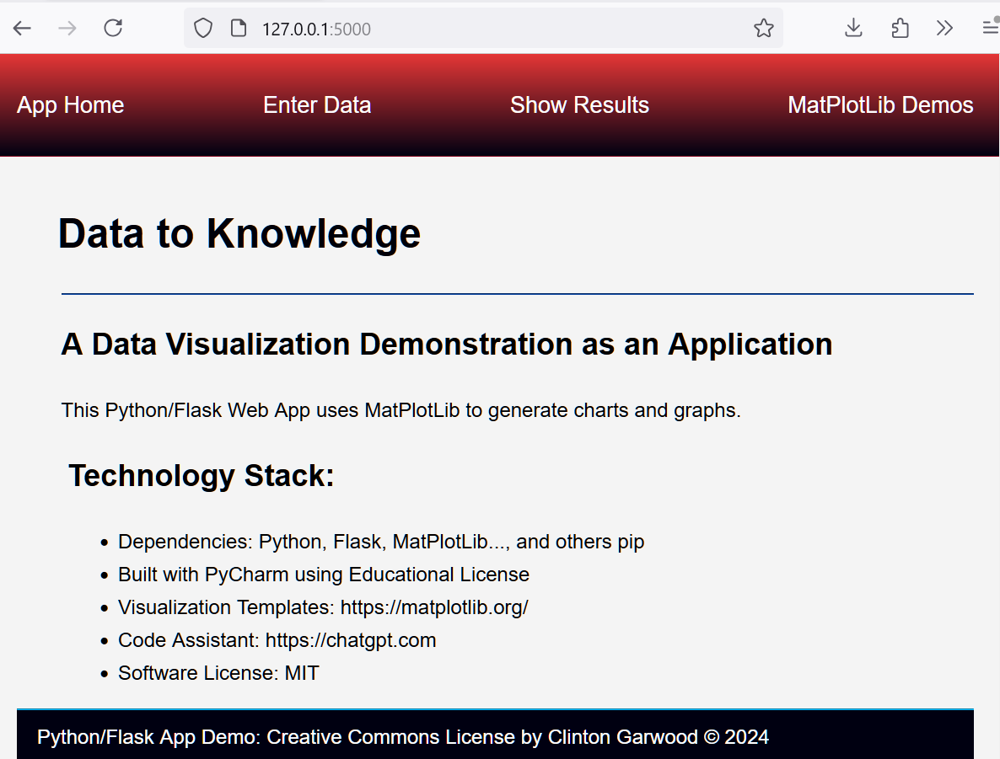
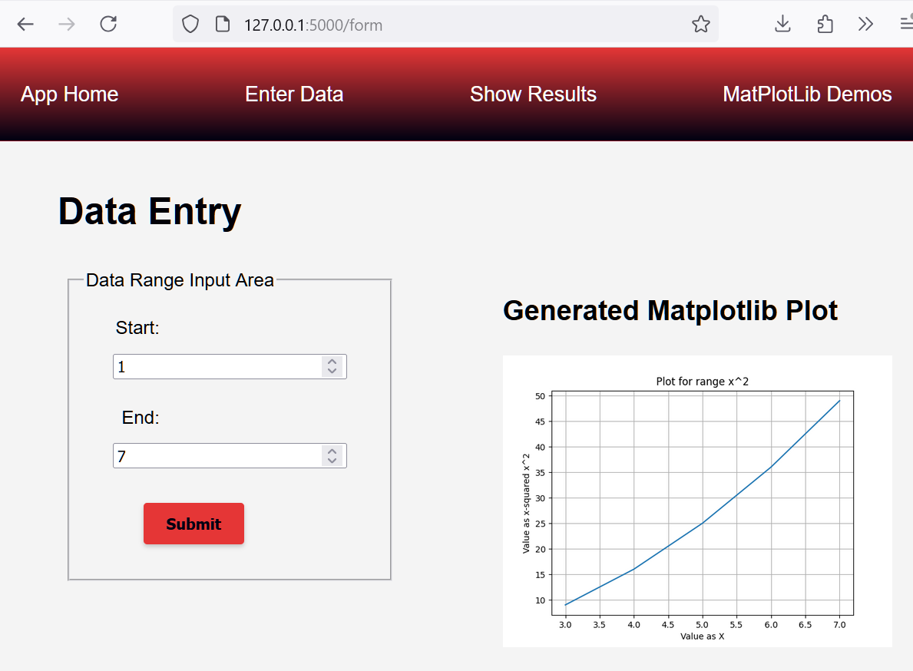
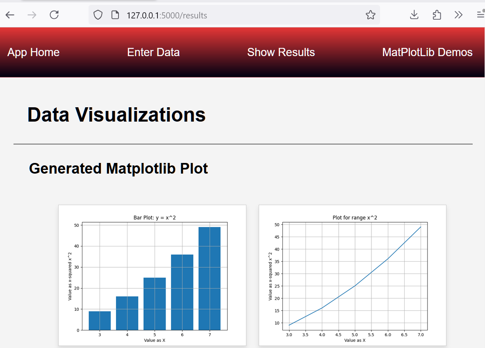
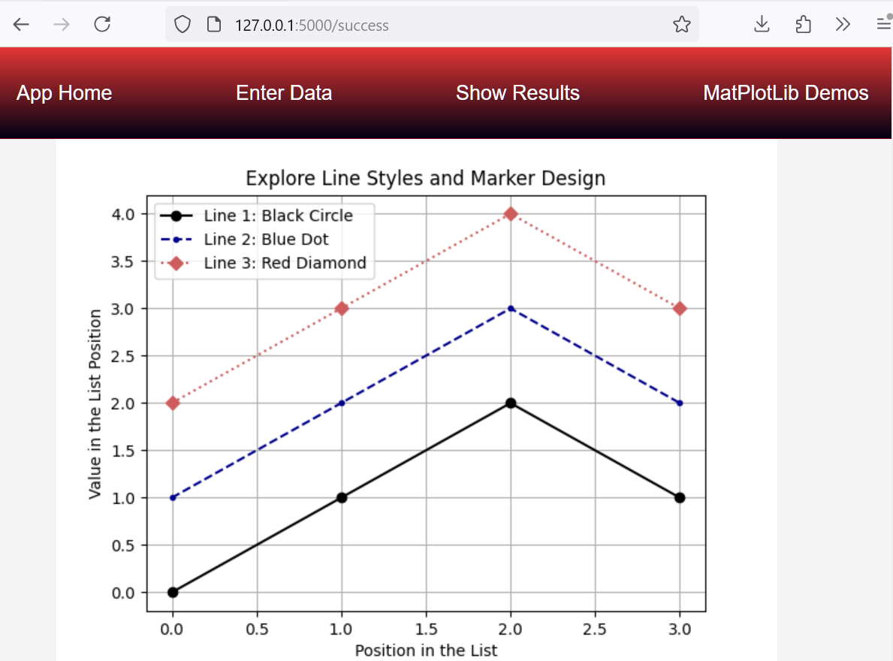

# Info to Knowledge a Micro Python/Flask/MatPlotLib Web App

## App Overview:
Demonstration application showing MatPlotLib data  
visualizations using a web form (data entry) within 
a Python Flask environment. 

<br>This File: Readme.md
<br>License: MIT 
<br>Online Version: https://github.com/theCodingProfessor/data_to_knowledge
<hr>

### Info App Home


### App Data Entry Form


### App Results


### App Demonstrations


### Site Requirements:

See the requirements.txt file for packages. 
```bash 
>> pip install -r requirements.txt
```

#### Partial Site Directory
```text 
app.py
requirements.txt
./templates
    footer.html
    index.html
    nav.html
    results.html
    success.html
    web_form.html
./jupyter_resources
    many files
./mat_plot_demos
    many files
./static
  ../img
      many files
  ../css
      site_styles.css
  ../docs
      Readme.md
  ../js
      set_date.js
      data_buttons.js
```
